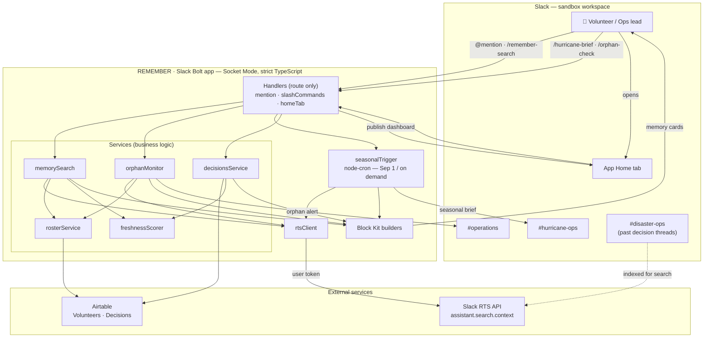

# REMEMBER — Architecture Diagram

Renderable Mermaid source for the submission. GitHub/Devpost preview it inline;
to get a PNG/SVG for upload, paste into **https://mermaid.live** → Actions → Export.

## The four flows

1. **Memory search** — `@mention` / `/remember-search` → `memorySearch` queries the
   **RTS API** (semantic), enriches each result with the decision owner
   (`rosterService` → Airtable) and a freshness score (`freshnessScorer`), and
   replies with Block Kit cards.
2. **Freshness / decay dashboard (Home tab)** — `homeTab` reads the Decisions
   registry (`decisionsService` → Airtable), scores each by `LastVerified`, and
   publishes the 🟢/🟡/🔴 health view.
3. **Orphan monitor** — `/orphan-check` → `orphanMonitor` finds inactive
   volunteers (`rosterService`), searches their decisions via RTS, and posts a
   reassignment alert to `#operations`.
4. **Seasonal brief** — `node-cron` (Sep 1) or `/hurricane-brief` → `seasonalTrigger`
   pulls last-season threads via RTS and posts the protocol review to
   `#hurricane-ops`.

**Hackathon technology:** Slack **Real-Time Search (RTS) API** (`assistant.search.context`).
Airtable (via the Airtable API) backs the roster + decision registry; Block Kit
renders the UI.
